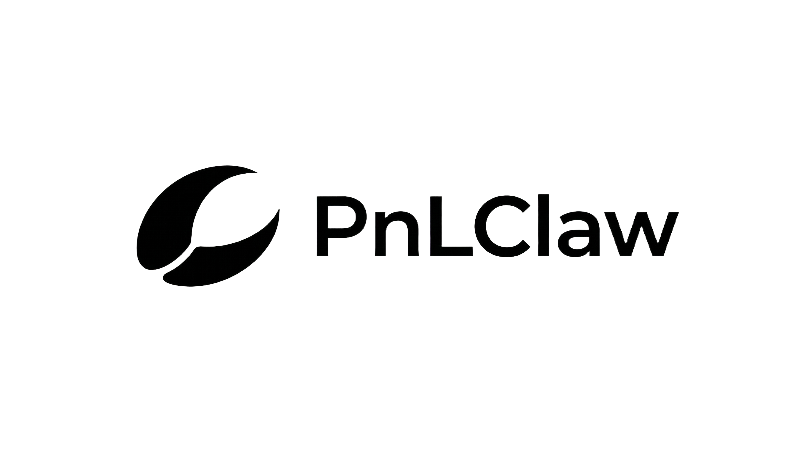

<div align="center">
  
  <br /><br />
  <p><strong>Chat is Quant — Local-first AI-powered crypto quantitative research</strong><br />
  Drive the entire strategy lifecycle through natural language conversation.<br />
  Native WebSocket feeds · ReAct Agent · 8 built-in Skills · MCP extensible · Your data stays local.</p>
  <br />

  [](https://github.com/YicunAI/Pnlclaw-community)
  [](LICENSE)
  [](https://www.python.org/)
  [](https://nextjs.org/)
  [](CHANGELOG.md)
  [](CONTRIBUTING.md)

  <br />
  <a href="#"><strong>English</strong></a> ·
  <a href="README.zh-CN.md">简体中文</a> ·
  <a href="#quick-start">Quick Start</a> ·
  <a href="#security">Security</a> ·
  <a href="CHANGELOG.md">Changelog</a>

</div>

---

## Overview & Design Philosophy

PnLClaw Community is an **open-source, local-first platform** for crypto quantitative research and prediction market workflows.

**The fundamental difference from traditional quant tools: you don't write code.** Describe your trading ideas in natural language, and the AI Agent handles everything from strategy design to backtest validation — then keeps iterating through multi-turn conversation to autonomously explore better parameters.

Unlike cloud-based quant platforms, PnLClaw runs entirely on your machine. We designed it with these core principles:

1. **Chat is Quant**: Built-in AI Agent with a ReAct reasoning loop and full multi-turn conversation context. Describe your strategy idea in natural language, and the Agent generates YAML configs, runs backtests, analyzes results, and suggests optimizations — forming a complete closed loop: Design → Validate → Backtest → Iterate → Deploy.
2. **Local-First & Privacy**: No subscription, no data leaving your system, no intermediary. Your API keys and strategies stay on your hardware.
3. **Unified Event-Driven Architecture**: Streams live market data directly from exchange native WebSocket APIs. Backtesting, paper trading, and live execution all share the exact same event loop and unified L2 orderbook data models. Write your strategy once, run it anywhere.
4. **Skill-Driven Agent Architecture**: 8 built-in quantitative Skills covering strategy drafting, backtest explanation, market analysis, risk reporting, and more. Extensible via MCP (Model Context Protocol), with support for custom user Skills. LLM-agnostic — works with any OpenAI-compatible endpoint or local Ollama.
5. **Security-by-Design**: High-risk capabilities are gated. Secrets never enter prompts or logs, and the agent has no ambient shell or file authority by default.

> PnLClaw Community is open-source (AGPLv3) and focused on local-first workflows.
> Multi-tenant SaaS, cloud execution, and HFT capabilities are not included in this release — coming soon.

---

## Why PnLClaw

<table>
<tr>
<td width="50%">

🗣️ **Chat = Strategy, Zero Code Barrier**

Describe your trading idea in natural language. The Agent auto-generates executable YAML strategies and runs backtests. No Python or Pine Script needed — just speak your mind.

</td>
<td width="50%">

🧠 **Long-Term Memory, Precise Intent Tracking**

The Agent retains full memory of the entire conversation. Say "backtest that strategy above" or "change the stop-loss to 3%," and it locates the prior config and continues — context never gets lost.

</td>
</tr>
<tr>
<td>

🔄 **Full Closed-Loop Workflow, AI Self-Optimization**

Design → Validate → Backtest → Analyze → Optimize → Deploy, all within a single conversation. The Agent analyzes backtest metrics and autonomously explores better parameter combinations.

</td>
<td>

🎯 **8 Built-in Quant Skills**

Each Skill is a specialized workflow: strategy drafting, code generation, backtest interpretation, market analysis, PnL attribution, risk reporting, indicator education, exchange setup. Custom Skills supported.

</td>
</tr>
<tr>
<td>

🔮 **Native Prediction Market Support, Blue Ocean Advantage**

Rare native Polymarket CLOB integration — live orderbook, event lifecycle tracking, implied probability analysis. Also supports Binance / OKX spot and futures for cross-market strategy research.

</td>
<td>

🛡️ **Extreme Privacy, Data Never Leaves Your Machine**

No cloud dependency, no subscription fees. API keys live only on your machine. LLM can be local Ollama. Secrets are redacted by the Security Gateway and never enter prompts or logs.

</td>
</tr>
</table>

---

## Core Features

| Area | What you get |
|---|---|
| **AI Agent** | ReAct reasoning loop · Multi-turn conversation context · Natural language strategy generation · Autonomous backtest analysis · Strategy iteration suggestions · Hallucination detection |
| **Skills System** | 8 built-in quant Skills · Multi-source registry (project / user / workspace level) · Custom Skill support · Automatic tool dependency validation |
| **Strategy Closed-Loop** | Conversational design → YAML validation → Event-driven backtest → Metric analysis → Parameter optimization → Version save → Paper deployment → Continuous monitoring |
| **Real-time Market Data** | Native L2 orderbook streams · Kline/OHLCV · Ticker · Unified event model across all exchanges (Binance, OKX, Polymarket) |
| **Strategy Engine** | YAML-based strategy configs · Indicator registry (SMA, EMA, RSI, BBANDS, MACD, …) · Strict Schema validation |
| **Backtesting** | Event-driven engine · Full portfolio accounting · Sharpe, max drawdown, win rate, Calmar, Sortino, Recovery Factor, and more |
| **Paper Trading** | Simulated fills from live L2 data · Position & balance tracking · Real-time unrealized PnL · Multi-account isolation |
| **Security Gateway** | Secrets never enter prompts or logs · Per-tool risk policy · Shell & file-write disabled by default |
| **MCP Protocol** | Runtime MCP server registration · Dynamic Agent tool extension · Compatible with mainstream MCP ecosystem |
| **Desktop App** | Next.js + Tauri native app · Candlestick charts · Live orderbook panel · Agent chat · Strategy & backtest manager |

---

## Conversational Quant Workflow

PnLClaw's core experience is a **conversation-driven strategy lifecycle**. The Agent is not just a chat window — it's your quant research partner that maintains context across turns, autonomously calls tools, and completes full workflows.

### One Conversation, Full Strategy Lifecycle

```
You: Design an EMA crossover strategy for BTC/USDT, 1-hour timeframe
Agent: [calls strategy_validate] Generated strategy config: EMA(20) crosses above EMA(50) to go long,
       crosses below to close...

You: Backtest it for the last 90 days
Agent: [calls backtest_run] Backtest complete. Total return +12.3%, Sharpe 1.45, max drawdown -6.8%.
       Suggestion: Win rate at 52% is low — consider adding an RSI filter to reduce false signals.

You: OK, add an RSI > 40 entry filter
Agent: [calls strategy_validate → backtest_run] Updated strategy and re-ran backtest.
       Sharpe improved to 1.72, win rate up to 58%, max drawdown narrowed to -5.1%. Clear improvement.

You: Nice, deploy it to paper trading
Agent: [calls create_paper_account → deploy_strategy] Created strategy account and deployed...
```

### Key Multi-Turn Capabilities

- **Full Context Memory**: The Agent has complete memory of all messages in the conversation. Say "backtest the strategy above," and it automatically extracts the full config from earlier messages.
- **Intent Continuity**: When you selected "1. Validate" or "2. Backtest" in the previous turn, the Agent carries forward all relevant context — it never treats follow-ups as isolated requests.
- **Progressive Optimization**: The Agent analyzes backtest metrics and proactively suggests improvements. You can iterate parameters back and forth in conversation while the Agent explores better combinations.
- **Smart Context Compression**: When conversations grow long, the Agent auto-compresses older turns while preserving key information, ensuring it stays within model context limits.

### Autonomous Strategy Iteration

The Agent doesn't just execute your instructions — it **proactively analyzes results and suggests next steps**:

- Sharpe too low? Suggests adjusting stop-loss ratios or adding trend filters
- Low win rate but high risk-reward? Suggests maintaining strategy logic but reducing position size
- Max drawdown too large? Suggests tighter risk controls or shorter holding periods
- Too few trades? Suggests relaxing entry conditions or switching to a shorter timeframe

Across multi-turn dialogues, this forms a **human-AI collaborative optimization loop**: you bring trading intuition and risk preferences, the Agent brings data analysis and parameter exploration.

---

## AI Agent & Built-in Skills

PnLClaw embeds an AI agent runtime with a ReAct (Reasoning + Acting) loop and **8 built-in quantitative Skills**. The agent is LLM-provider-agnostic — point it at any OpenAI-compatible endpoint or a local [Ollama](https://ollama.com) model.

### Built-in Skills

| Skill | Description |
|---|---|
| `strategy-draft` | Guide you through drafting and validating a YAML strategy config via interactive dialogue |
| `strategy-coder` | Produce a complete executable strategy YAML from a plain-language description |
| `backtest-explain` | Explain backtest metrics (Sharpe, MDD, win rate) in plain language, highlight risks and optimization directions |
| `market-analysis` | Analyze current market state using ticker, candles, and orderbook data, with multi-timeframe support |
| `pnl-explain` | Break down paper trading PnL composition and attribution, pinpoint profit/loss sources |
| `risk-report` | Summarize risk exposure across open positions, assess overall risk |
| `indicator-guide` | Explain how indicators work, their parameters, and when to use them |
| `exchange-setup` | Walk through exchange API credential configuration securely |

### Skill Registry

Skills are not hardcoded — PnLClaw implements a **multi-source layered registry** with four priority levels:

```
workspace skills (highest priority)  →  project-level customization
user skills                          →  ~/.pnlclaw/skills/, reusable across projects
bundled skills                       →  project skills/ directory, 8 built-in skills
extra skills (lowest priority)       →  additional directories via config
```

- Same-name Skills are automatically deduplicated by priority — you can override built-in Skill behavior at the workspace or user level
- Each Skill declares tool dependencies (`requires_tools`), and the registry automatically validates that required tools are available
- Enable/disable switches let you tailor the Agent's capabilities

### MCP Protocol Extension

Register MCP (Model Context Protocol) servers at runtime to dynamically extend the Agent's toolset. Connect community or custom MCP tools to give the Agent additional capabilities (e.g., more data sources, custom analysis).

### ReAct Reasoning Engine

The Agent's core decision loop:

```
Observe → Think → Act (call tools) → Reflect → Answer
```

- Each round evaluates: Is the collected information sufficient? Are more tool calls needed?
- Built-in loop detection: same tool called 3+ times with identical arguments triggers automatic termination
- Hallucination detection: final answers are verified by Security Gateway's Hallucination Detector
- Token-aware: monitors context usage and proactively compresses history when approaching limits

---

## Practical Structure & Architecture

PnLClaw is built as a modular monorepo. The architecture strictly separates the frontend UI, the local API orchestrator, and the domain-specific core packages.

```text
PnLClaw Community
│
├─ apps/desktop/             ← Next.js 16 + Tauri 2 desktop application (The UI)
│
├─ services/local-api/       ← FastAPI local backend (The Orchestrator, default: localhost:8080)
│
├─ skills/                   ← Built-in quantitative skills (8 SKILL.md definition files)
│
└─ packages/                 ← Domain-Driven Core Modules
   ├─ core                   ← Shared config, structured logging, exceptions, utilities
   ├─ shared-types           ← Unified Pydantic event & data models (The single source of truth)
   ├─ exchange-sdk           ← Native WebSocket adapters (Binance · OKX · Polymarket)
   ├─ market-data            ← Stream normalization · In-memory L2 cache · Event bus
   ├─ strategy-engine        ← YAML strategy compiler · Indicator registry · Validation · Runtime
   ├─ backtest-engine        ← Event-driven backtester · Portfolio · Metrics
   ├─ paper-engine           ← Simulated execution · Fills · Positions · PnL
   ├─ risk-engine            ← Rule-based pre-trade risk controls
   ├─ agent-runtime          ← AI agent · ReAct loop · Skill registry · MCP client
   ├─ llm-adapter            ← LLM provider abstraction (OpenAI-compat · Ollama)
   ├─ security-gateway       ← Guardrails · Secrets redaction · Tool policy · Hallucination detection
   └─ storage                ← SQLite metadata + time-series persistence
```

**Local execution flow:**

```text
Desktop UI → Local API (FastAPI:8080) → Exchange SDK (native WS)
                                      → Strategy / Backtest / Paper Engine
                                      → Agent Runtime (ReAct + Skill Registry)
                                      → Risk Engine
```

---

## Quick Start

### Prerequisites

- Python 3.11+
- Node.js 18+
- [uv](https://github.com/astral-sh/uv) (recommended) or pip
- Rust toolchain (only needed for `tauri build`)

### Network Requirements

> **Important:** PnLClaw connects to Binance, OKX, Polymarket and other exchange WebSocket & REST APIs.
>
> **If you are in mainland China, you must use a VPN/proxy in Global Mode.** PAC / rule-based mode may not cover WebSocket connections, causing market data to fail.
>
> Proxy configuration (pick one):
>
> 1. **System global proxy** (simplest): Set your proxy tool to global mode — PnLClaw auto-detects system proxy
> 2. **Environment variable**: Set `PNLCLAW_PROXY_URL=socks5://127.0.0.1:7890` (adjust port to match your proxy)
> 3. **In-app setting**: After launch, go to Settings → Network and enter your proxy URL
>
> If you are outside mainland China or have unrestricted network access, skip this step.

### 1. Clone

```bash
git clone https://github.com/YicunAI/Pnlclaw-community.git
cd Pnlclaw-community
```

### 2. Install Python packages

```bash
# Install uv (ultra-fast Python package manager)
pip install uv

uv pip install -e ".[dev]" \
  -e packages/core \
  -e packages/shared-types \
  -e packages/exchange-sdk \
  -e packages/market-data \
  -e packages/strategy-engine \
  -e packages/backtest-engine \
  -e packages/paper-engine \
  -e packages/risk-engine \
  -e packages/agent-runtime \
  -e packages/llm-adapter \
  -e packages/security-gateway \
  -e packages/storage
```

<details>
<summary>Using pip instead of uv</summary>

```bash
pip install -e ".[dev]" \
  -e packages/core \
  -e packages/shared-types \
  -e packages/exchange-sdk \
  -e packages/market-data \
  -e packages/strategy-engine \
  -e packages/backtest-engine \
  -e packages/paper-engine \
  -e packages/risk-engine \
  -e packages/agent-runtime \
  -e packages/llm-adapter \
  -e packages/security-gateway \
  -e packages/storage
```

</details>

### 3. Configure

```bash
cp .env.example .env
```

At minimum, set your exchange credentials and LLM endpoint:

```env
# Exchange — start with testnet / read-only keys
PNLCLAW_BINANCE_API_KEY=your_key
PNLCLAW_BINANCE_API_SECRET=your_secret
PNLCLAW_BINANCE_TESTNET=true

# LLM — any OpenAI-compatible endpoint, or a local Ollama model
PNLCLAW_LLM_PROVIDER=openai_compatible
PNLCLAW_LLM_BASE_URL=http://localhost:11434/v1
PNLCLAW_LLM_MODEL=llama3.2

# Proxy (required in mainland China — adjust port to match your proxy tool)
PNLCLAW_PROXY_URL=socks5://127.0.0.1:7890
```

> **Safe by default.** Real trading (`PNLCLAW_ENABLE_REAL_TRADING`), shell tools, and file-write tools are all `false` out of the box.
>
> **We strongly recommend using the Testnet for your first experience.** The example above defaults to `PNLCLAW_BINANCE_TESTNET=true`, ensuring no real funds are at risk.

### 4. Start the local API (backend)

```bash
cd services/local-api
uvicorn app.main:app --host 127.0.0.1 --port 8080 --reload
```

On success you should see logs like:

```
INFO:app.main: Subscribed BTC/USDT on binance/spot
INFO:app.main: PnLClaw Local API started with multi-source MarketDataService
```

Interactive API docs: `http://localhost:8080/docs`

### 5. Start the desktop UI (frontend)

Open a second terminal:

```bash
cd apps/desktop
npm install
npm run dev          # browser (localhost:3000)
# or
npm run tauri:dev    # native desktop window (requires Rust toolchain)
```

Visit `http://localhost:3000` once the dev server is ready.

### Startup Checklist

| Check | Expected |
|---|---|
| Backend started | Terminal shows `PnLClaw Local API started` |
| Market connected | Terminal shows `Subscribed BTC/USDT on binance/spot` |
| API reachable | `http://localhost:8080/docs` loads in browser |
| Frontend started | `http://localhost:3000` shows the UI |
| Live data flowing | BTC/USDT price updates in real time on Dashboard |

> **Troubleshooting:** If market data is missing or WebSocket connections time out, verify your proxy is running in **Global Mode**.

---

## Exchanges

| Exchange | Spot WS | L2 Orderbook | Kline | REST | Notes |
|---|:---:|:---:|:---:|:---:|---|
| **Binance** | ✅ | ✅ | ✅ | ✅ | Testnet supported |
| **OKX** | ✅ | ✅ | ✅ | ✅ | Demo mode supported |
| **Polymarket** | ✅ | ✅ | — | ✅ | CLOB prediction market |

All exchange data is normalized into a **unified internal event model**. Your strategies and the agent see identical types regardless of which exchange is active.

---

## Configuration Reference

| Variable | Default | Description |
|---|---|---|
| `PNLCLAW_API_PORT` | `8080` | Local API port |
| `PNLCLAW_DEFAULT_EXCHANGE` | `binance` | Active exchange |
| `PNLCLAW_DEFAULT_SYMBOL` | `BTCUSDT` | Default symbol |
| `PNLCLAW_LLM_PROVIDER` | `openai_compatible` | LLM backend |
| `PNLCLAW_LLM_BASE_URL` | — | LLM endpoint URL |
| `PNLCLAW_LLM_MODEL` | — | Model name |
| `PNLCLAW_PAPER_STARTING_BALANCE` | `10000` | Paper account starting balance (USDT) |
| `PNLCLAW_ENABLE_REAL_TRADING` | `false` | Enable live order execution |
| `PNLCLAW_ENABLE_SHELL_TOOLS` | `false` | Allow agent shell access |
| `PNLCLAW_ENABLE_AGENT_DRAFTING` | `true` | AI strategy drafting |
| `PNLCLAW_ENABLE_PAPER_TRADING` | `true` | Paper trading engine |
| `PNLCLAW_ENABLE_BACKTEST` | `true` | Backtesting engine |

Full reference: [`.env.example`](.env.example)

---

## Tech Stack

| Layer | Technology |
|---|---|
| **Desktop Shell** | Tauri 2 (Rust-based, lightweight, cross-platform) |
| **Frontend** | Next.js 16 (App Router) · React 19 · TypeScript · Tailwind CSS v4 · shadcn/ui · Framer Motion · SWR |
| **Charts & UI** | lightweight-charts (TradingView) |
| **Local API** | FastAPI · uvicorn (Async, high-performance Python web framework) |
| **Core Runtime** | Python 3.11+ (Strictly typed) |
| **Data Models** | Pydantic v2 (High-performance schema validation) |
| **Data Processing** | pandas · numpy |
| **Local Storage** | SQLite (aiosqlite for async operations) |
| **Exchange Adapters** | Native WebSocket (`websockets`) · `httpx` · `orjson` |
| **LLM Integration** | OpenAI-compatible · Ollama (Local models) |
| **Logging** | `structlog` (Structured JSON logging) |
| **Testing & Tooling** | `pytest` · `pytest-asyncio` · `uv` (Ultra-fast package manager) |

---

## Running Tests

```bash
# All packages
pytest

# Specific area
pytest packages/backtest-engine/tests/
pytest packages/paper-engine/tests/
pytest packages/exchange-sdk/tests/
pytest packages/agent-runtime/tests/

# Integration
pytest tests/integration/
```

---

## Security

PnLClaw is **not** a generic high-privilege agent.

- Secrets never enter LLM prompts, responses, or log files
- All tool calls are classified (safe / restricted / dangerous) and gated by `security-gateway`
- Shell execution, file writes, and external fetch are disabled by default
- The agent has no ambient shell, file, or network authority
- Final outputs are verified by the Hallucination Detector
- Real-money trading requires an explicit opt-in flag

---

## Contributing

Contributions are welcome. Please review the project structure and architecture section above before opening a PR.

- Keep module boundaries clean — packages must not import each other's internals
- New high-risk capabilities must go through `security-gateway`
- New exchange adapters belong in `packages/exchange-sdk`
- Tests are required for new engine and SDK code
- Custom Skill contributions welcome — add to the `skills/` directory

### Contributors

<a href="https://github.com/YicunAI/Pnlclaw-community/graphs/contributors">
  
</a>

<sub>Made with [contrib.rocks](https://contrib.rocks)</sub>

---

## Roadmap

### Shipped (v0.1)

- [x] Native WebSocket exchange adapters (Binance, OKX, Polymarket)
- [x] Unified L2 orderbook event model
- [x] YAML strategy engine with indicator registry
- [x] Event-driven backtest engine with full metrics
- [x] Paper trading engine with simulated fills
- [x] AI agent runtime with ReAct loop and built-in skills
- [x] Multi-turn conversation context management with smart compression
- [x] 8 built-in quant Skills with layered registry
- [x] MCP tool protocol integration
- [x] Desktop UI (Next.js + Tauri)

### Crypto Market Deep Dive

- [ ] Perpetual futures support (funding rate strategies, Open Interest signals)
- [ ] On-chain data integration (whale tracking, Smart Money flow, token transfer monitoring)
- [ ] CEX-CEX cross-exchange arbitrage detection & signals
- [ ] Liquidation cascade monitoring & heatmap
- [ ] Crypto sentiment analysis (social media signals, news event extraction)
- [ ] DEX integration (Uniswap, dYdX on-chain feeds)
- [ ] CEX-DEX cross-market arbitrage strategies
- [ ] Multi-chain data aggregation (EVM, Solana, Cosmos)

### Prediction Market Focus

- [ ] Polymarket deep integration (event lifecycle tracking, conditional token parsing, expiry settlement monitoring)
- [ ] Prediction market making strategies (CLOB order placement, spread management, inventory control)
- [ ] Cross-platform prediction market arbitrage (Polymarket vs Kalshi vs others)
- [ ] Event-driven strategy templates (macro economy, elections, sports, crypto events)
- [ ] Implied probability calibration & pricing deviation analysis
- [ ] News-driven event probability estimation (Agent autonomous fetching + analysis)

### AI-Driven & Alpha Discovery

- [ ] LLM-driven sentiment & public opinion analysis (social media, news event extraction & quantification)
- [ ] Reinforcement Learning & Machine Learning strategy research (deep networks, time-series prediction models)
- [ ] Multi-dimensional trading data feature engineering (complex orderbook features, high-frequency microstructure)
- [ ] Alternative data & Alpha factor injection (unstructured data parsing, multi-factor model construction)

### Agent Intelligence Evolution

- [ ] AI-driven strategy parameter auto-optimization (Grid Search + Bayesian Optimization)
- [ ] Multi-agent collaboration (Analyst + Risk + Execution multi-role consensus)
- [ ] Vector semantic memory (cross-session strategy knowledge retrieval)
- [ ] 7×24 market anomaly scanning with proactive alerts
- [ ] Agent autonomous research report generation (periodic market review + strategy attribution)

### Infrastructure

- [ ] CLI interface (`pnlclaw` command-line tool)
- [ ] Historical data import (Parquet, CSV, on-chain snapshots)
- [ ] Strategy versioning and A/B comparison
- [ ] Additional technical indicators & crypto-specific strategy templates
- [ ] Live execution engine (explicit opt-in + risk gateway approval required)

---

## Feedback & Contact

PnLClaw is in **early rapid iteration** — every Star, Issue, and PR fuels our progress.

⭐ If you find this project valuable, please [**give it a Star**](https://github.com/YicunAI/Pnlclaw-community) — it's the best encouragement for open-source authors.

- **GitHub Issues** — [open an issue](../../issues) for bug reports, feature requests, or usage feedback
- **Pull Requests** — [open a PR](../../pulls), whether fixing a typo or contributing a new Skill — we take every contribution seriously
- **Email** — [yicun@pnlclaw.com](mailto:yicun@pnlclaw.com) for anything else

---

## Acknowledgments

- Thanks to the [linux.do](https://linux.do) community for their support, discussions, sharing, and feedback, which made PnLClaw's iteration more efficient.
- Thanks to Any for the public welfare token support, which accelerated the development of PnLClaw.

---

## License

GNU Affero General Public License v3.0 — see [LICENSE](LICENSE).

---

<div align="center">
  <sub>Built with care for the quant community · AGPLv3 · Community v0.1</sub>
</div>
