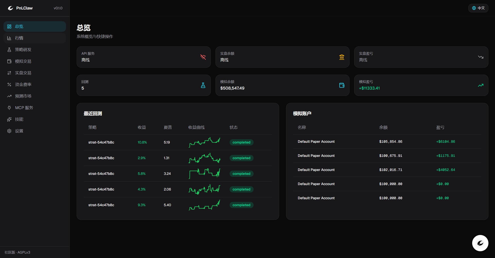
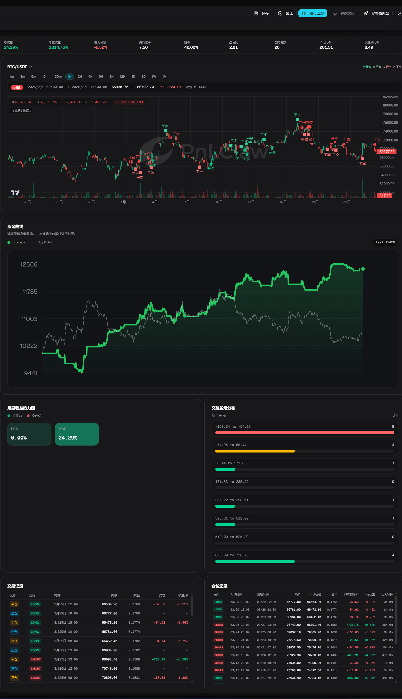
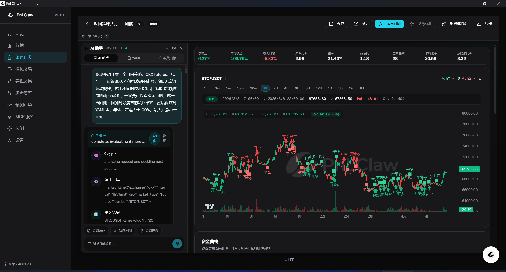
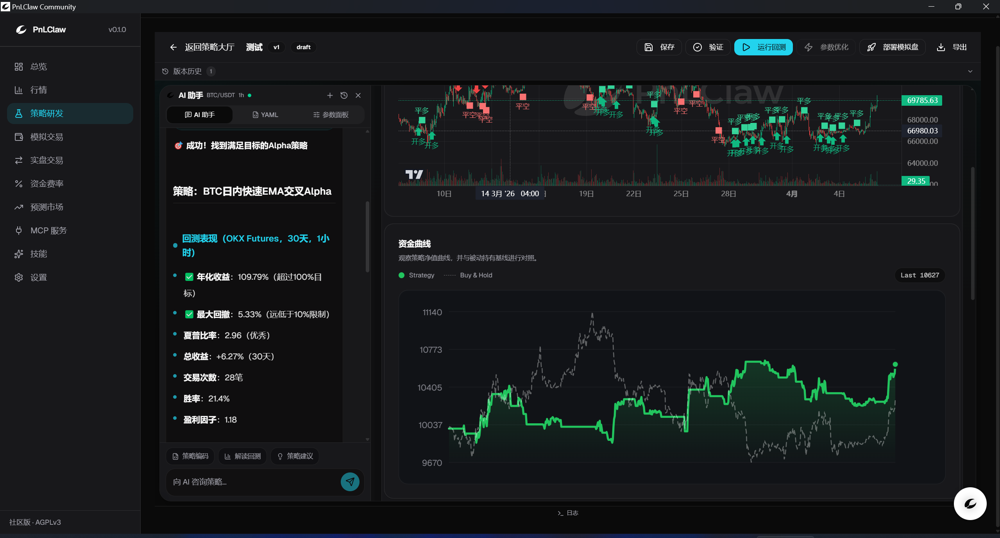
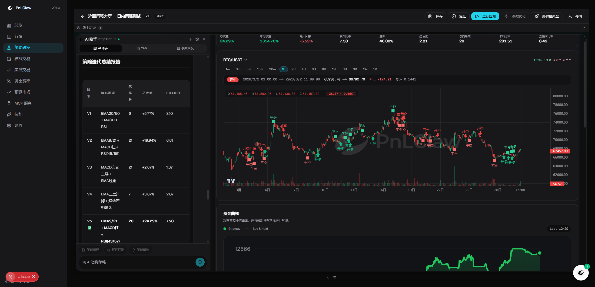
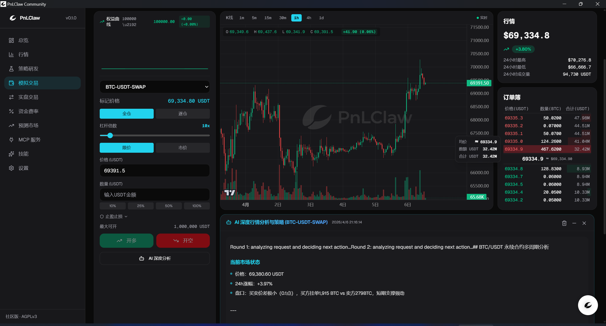
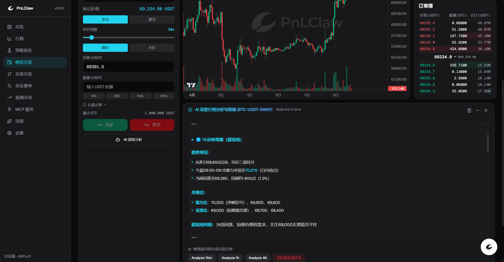
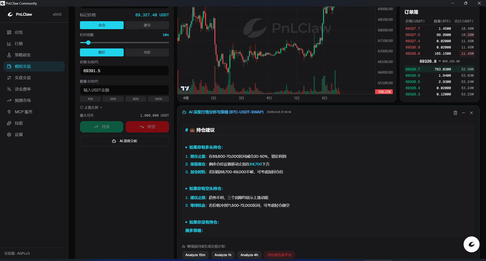

<div align="center">
  
  <br /><br />
  <p><strong>对话即量化 —— 本地优先的 AI 量化研究平台</strong><br />
  用自然语言对话驱动策略设计、回测、模拟交易的完整闭环。<br />
  原生 WebSocket 行情 · ReAct Agent · 8 个内置技能 · MCP 可扩展 · 数据不出本机。</p>
  <br />

  [](https://github.com/YicunAI/Pnlclaw-community)
  [](LICENSE)
  [](https://www.python.org/)
  [](https://nextjs.org/)
  [](CHANGELOG.md)
  [](CONTRIBUTING.md)

  <br />
  <a href="README.md">English</a> ·
  <a href="#"><strong>简体中文</strong></a> ·
  <a href="#快速开始">快速开始</a> ·
  <a href="#安全设计">安全</a> ·
  <a href="CHANGELOG.md">更新日志</a>

  <br /><br />
  

</div>

---

## 项目简介与设计理念

PnLClaw Community 是一个**开源、本地优先**的加密量化研究与预测市场工作流平台。

**和传统量化工具的本质区别：你不需要写代码。** 你只需要用自然语言告诉 AI Agent 你的交易思路，它会帮你完成从策略设计到回测验证的全部流程——然后在多轮对话中持续迭代，自主探索更优参数。

与云端量化平台不同，PnLClaw 完全运行在你的机器上。我们基于以下核心理念进行设计：

1. **对话即量化**：内置 ReAct 推理循环的 AI Agent，支持完整的多轮对话上下文。用自然语言描述策略思路，Agent 自动生成 YAML 配置、运行回测、分析结果并建议优化方向——形成「设计 → 验证 → 回测 → 迭代 → 部署」的完整闭环。
2. **本地优先与隐私安全**：无需订阅、数据不离本地、无任何中间商。你的 API 密钥和策略代码永远留在你的硬件上。
3. **统一的事件驱动架构**：直接通过交易所原生 WebSocket API 流式获取行情。回测、模拟交易和实盘执行共享完全相同的事件循环和统一的 L2 盘口数据模型。一次编写策略，到处运行。
4. **技能驱动的 Agent 架构**：8 个内置量化技能（Skill）覆盖策略起草、回测解释、市场分析、风险报告等核心场景。支持 MCP（模型上下文协议）扩展，用户可自定义 Skill。与 LLM 解耦——兼容 OpenAI 协议或本地 Ollama。
5. **安全设计 (Security-by-Design)**：高风险能力被严格管控。密钥绝不进入提示词或日志，Agent 默认不具备 Shell 或文件系统的访问权限。

> PnLClaw Community 是开源项目（AGPLv3），专注于本地优先工作流。
> 多租户 SaaS、云端执行和 HFT 能力不在本版本范围内，将会尽快推出。

---

## 为什么选择 PnLClaw

<table>
<tr>
<td width="50%">

🗣️ **对话即策略，零代码门槛**

用自然语言描述交易想法，Agent 自动生成可执行的 YAML 策略并运行回测。不需要 Python / Pine Script 经验——开口就是策略。

</td>
<td width="50%">

🧠 **长时记忆，意图精准连贯**

Agent 完整记忆整段对话。说"回测上面那个策略"、"把止损改成 3%"，它自动定位之前的配置并继续操作，无需反复粘贴，上下文永不丢失。

</td>
</tr>
<tr>
<td>

🔄 **全闭环工作流，AI 自主寻优**

设计 → 校验 → 回测 → 分析 → 优化 → 部署，全部在一次对话中完成。Agent 分析回测指标后主动建议优化方向，自主探索更优参数组合。

</td>
<td>

🎯 **8 个内置量化技能**

每个 Skill 是一套专精工作流：策略起草、代码生成、回测解读、市场分析、PnL 归因、风险报告、指标教学、交易所配置。支持用户自定义 Skill 扩展。

</td>
</tr>
<tr>
<td>

🔮 **预测市场原生支持，抢占蓝海**

业内罕见的 Polymarket CLOB 原生接入——实时盘口、事件生命周期追踪、隐含概率分析。同时支持 Binance / OKX 加密现货与合约，跨市场策略一站式研究。

</td>
<td>

🛡️ **极客级隐私，数据绝不出机**

无云端依赖、无订阅费。API 密钥只存在本地，LLM 可选本地 Ollama。密钥通过 Security Gateway 脱敏，绝不进入提示词或日志。

</td>
</tr>
</table>

---

## 核心功能

| 模块 | 功能 |
|---|---|
| **AI Agent** | ReAct 推理循环 · 多轮对话上下文 · 自然语言策略生成 · 回测结果自主分析 · 策略迭代建议 · 幻觉检测 |
| **技能系统 (Skills)** | 8 个内置量化技能 · 多源注册表（项目级 / 用户级 / 工作区级）· 支持自定义 Skill · 工具依赖自动校验 |
| **策略闭环** | 对话式设计 → YAML 校验 → 事件驱动回测 → 指标分析 → 参数优化 → 版本保存 → 模拟盘部署 → 持续监控 |
| **实时行情** | 原生 L2 盘口流 · Kline/OHLCV · Ticker · 跨交易所（Binance, OKX, Polymarket）统一事件模型 |
| **策略引擎** | YAML 策略配置 · 指标注册表（SMA、EMA、RSI、BBANDS、MACD …）· 严格 Schema 校验 |
| **回测引擎** | 事件驱动回测 · 完整组合记账 · Sharpe、最大回撤、胜率、Calmar、Sortino、Recovery Factor 等 |
| **模拟交易** | 基于实时 L2 盘口撮合 · 仓位与余额跟踪 · 实时浮盈计算 · 多账户隔离 |
| **安全网关** | 密钥绝不进入提示词或日志 · 工具风险分级策略 · Shell 与文件写入默认禁用 |
| **MCP 协议** | 运行时注册 MCP 服务器 · 动态扩展 Agent 工具集 · 兼容主流 MCP 生态 |
| **桌面应用** | Next.js + Tauri 原生应用 · K 线图 · 实时盘口面板 · Agent 对话 · 策略与回测管理 |

<div align="center">
  
  <br />
  <sub>完整回测报告 —— K 线标记交易点位、资金曲线、月度收益热力图、信号分布、交易与合仓记录</sub>
</div>

---

## 对话式量化工作流

PnLClaw 的核心体验是**对话驱动的策略全生命周期管理**。Agent 不是一个简单的聊天窗口——它是你的量化研究伙伴，能在多轮对话中持续理解你的意图，自主调用工具完成完整的工作流。

### 一次对话，完成策略闭环

```
你：帮我设计一个 BTC/USDT 的 EMA 交叉策略，1 小时级别
Agent：[调用 strategy_validate] 已生成策略配置，EMA(20) 上穿 EMA(50) 做多，下穿平仓...

你：回测一下最近 90 天
Agent：[调用 backtest_run] 回测完成。总收益 +12.3%，Sharpe 1.45，最大回撤 -6.8%...
      建议：胜率 52% 偏低，可尝试加入 RSI 过滤条件来减少假信号。

你：好，加个 RSI > 40 的入场过滤
Agent：[调用 strategy_validate → backtest_run] 已更新策略并重新回测。
      Sharpe 提升至 1.72，胜率升至 58%，最大回撤收窄至 -5.1%。策略明显改善。

你：不错，部署到模拟盘
Agent：[调用 create_paper_account → deploy_strategy] 已创建策略账户并部署...
```

<div align="center">
  
  <br />
  <sub>AI Agent 策略设计推理过程 —— 分析行情数据、自主调用工具、生成策略配置</sub>
  <br /><br />
  
  <br />
  <sub>策略生成完成 —— 完整回测指标与资金曲线一目了然</sub>
</div>

### 多轮对话的关键能力

- **完整上下文记忆**：Agent 拥有对话内所有历史消息的完整记忆。说"回测上面那个策略"，它自动从之前的消息中提取完整配置。
- **意图连续性**：当你在上一轮选择了"1. 验证"或"2. 回测"，Agent 自动携带所有相关上下文继续工作，不会把后续当作孤立请求。
- **渐进式优化**：Agent 分析回测指标后主动建议优化方向。你可以在对话中反复迭代参数，Agent 自主探索更优组合。
- **智能上下文压缩**：对话过长时自动压缩历史轮次，保留关键信息，确保不超出模型上下文窗口。

### 策略自主迭代

Agent 不只是执行你的指令——它会**主动分析结果并建议下一步**：

- 回测 Sharpe 偏低？建议调整止损比例或加入趋势过滤
- 胜率低但盈亏比高？建议维持策略逻辑但缩小仓位
- 最大回撤过大？建议增加风控规则或缩短持仓周期
- 交易次数太少？建议放宽入场条件或切换更短的时间框架

在多轮对话中，这形成了一个**"人机协作"的策略优化循环**：你提供交易直觉和风险偏好，Agent 提供数据分析和参数探索能力。

<div align="center">
  
  <br />
  <sub>Agent 自主迭代 5 个策略版本 —— 对比不同参数组合与 Sharpe 比率，自动寻找最优参数</sub>
</div>

---

## AI Agent 与内置技能 (Skills)

PnLClaw 内置了带有 ReAct（Reasoning + Acting）推理循环的 AI Agent 运行时，预置 **8 个量化专精技能**。Agent 与 LLM 提供商解耦——可接入任意 OpenAI 兼容端点，或使用本地 [Ollama](https://ollama.com) 模型，数据不出本机。

### 内置技能一览

| 技能 | 说明 |
|---|---|
| `strategy-draft` | 通过引导式对话逐步起草并验证 YAML 策略配置 |
| `strategy-coder` | 将自然语言描述直接转换为完整的可执行策略 YAML |
| `backtest-explain` | 用通俗语言解释回测指标（Sharpe、最大回撤、胜率），指出风险点和优化方向 |
| `market-analysis` | 综合 Ticker、K 线和盘口数据分析当前市场状态，支持多周期分析 |
| `pnl-explain` | 拆解模拟账户的 PnL 构成与归因，定位盈亏来源 |
| `risk-report` | 汇总当前持仓的风险敞口，评估整体风险暴露 |
| `indicator-guide` | 解释各技术指标的原理、参数含义与适用场景 |
| `exchange-setup` | 引导完成交易所 API 凭证的安全配置 |

### 技能注册表 (Skill Registry)

Skill 不是硬编码的——PnLClaw 实现了一套**多源分层注册表**，支持四级来源优先级：

```
workspace 技能 (优先级最高)  →  项目级定制
user 技能                    →  ~/.pnlclaw/skills/，跨项目复用
bundled 技能                 →  项目内 skills/ 目录，8 个内置技能
extra 技能 (优先级最低)       →  通过配置指定的额外目录
```

- 同名 Skill 自动按优先级去重——你可以在 workspace 或 user 目录覆盖内置 Skill 的行为
- 每个 Skill 声明工具依赖（`requires_tools`），注册表自动校验当前可用工具是否满足
- 支持启用/禁用开关，可按需裁剪 Agent 能力

### MCP 协议扩展

支持在运行时注册 MCP（模型上下文协议）服务器，动态扩展 Agent 的工具集。你可以接入社区或自建的 MCP 工具，让 Agent 具备更多能力（例如接入更多数据源、执行自定义分析）。

### ReAct 推理引擎

Agent 的核心决策循环：

```
Observe（观察）→ Think（推理）→ Act（执行工具）→ Reflect（反思）→ Answer（回答）
```

- 每轮自动评估：已收集的信息是否足够回答用户？是否需要调用更多工具？
- 内置工具循环检测：相同参数重复调用同一工具超过 3 次自动终止
- 幻觉检测：最终回答经过 Security Gateway 的 Hallucination Detector 校验
- Token 感知：自动监控上下文使用量，接近上限时主动压缩历史轮次

### 模拟交易与 AI 深度行情分析

<div align="center">
  
  <br />
  <sub>模拟交易界面 —— 实时 L2 盘口、K 线图与 AI 深度行情分析</sub>
  <br /><br />
  
  <br />
  <sub>多周期趋势分析 —— 自动识别关键支撑与阻力位</sub>
  <br /><br />
  
  <br />
  <sub>AI 智能持仓管理建议 —— 针对多头、空头、空仓三种场景分别给出操作方案</sub>
</div>

---

## 实用结构与架构

PnLClaw 采用模块化的 Monorepo 结构构建。架构上严格分离了前端 UI、本地 API 编排层以及领域驱动的核心业务包。

```text
PnLClaw Community
│
├─ apps/desktop/             ← Next.js 16 + Tauri 2 桌面应用（用户界面）
│
├─ services/local-api/       ← FastAPI 本地后端（服务编排层，默认 localhost:8080）
│
├─ skills/                   ← 内置量化技能（8 个 SKILL.md 定义文件）
│
└─ packages/                 ← 领域驱动的核心模块
   ├─ core                   ← 共享配置、结构化日志、异常处理、通用工具
   ├─ shared-types           ← 统一的 Pydantic 事件与数据模型（单一事实来源）
   ├─ exchange-sdk           ← 原生 WebSocket 适配器（Binance · OKX · Polymarket）
   ├─ market-data            ← 行情归一化 · 内存 L2 缓存 · 事件总线
   ├─ strategy-engine        ← YAML 策略编译器 · 指标注册表 · 校验 · 运行时
   ├─ backtest-engine        ← 事件驱动回测 · 组合记账 · 指标计算
   ├─ paper-engine           ← 模拟撮合执行 · 成交 · 仓位 · PnL
   ├─ risk-engine            ← 规则型预交易风控
   ├─ agent-runtime          ← AI Agent · ReAct 循环 · 技能注册表 · MCP 客户端
   ├─ llm-adapter            ← LLM 提供商抽象（OpenAI 兼容 · Ollama）
   ├─ security-gateway       ← 安全护栏 · 密钥脱敏 · 工具权限策略 · 幻觉检测
   └─ storage                ← SQLite 元数据 + 时序持久化
```

**本地执行链路：**

```text
桌面 UI → 本地 API（FastAPI:8080）→ 交易所 SDK（原生 WS）
                                  → 策略 / 回测 / 模拟交易引擎
                                  → Agent 运行时（ReAct + 技能注册表）
                                  → 风控引擎
```

---

<a id="quick-start"></a>

## 快速开始

### 环境要求

- Python 3.11+
- Node.js 18+
- [uv](https://github.com/astral-sh/uv)（推荐）或 pip
- Rust 工具链（仅 `tauri build` 时需要）

### 网络要求

> **重要：** PnLClaw 需要连接 Binance、OKX、Polymarket 等境外交易所的 WebSocket 和 REST API。
>
> **如果你在中国大陆使用，必须开启科学上网，并切换到全局模式（Global Mode）。** 仅使用 PAC / 规则模式可能无法覆盖 WebSocket 连接，导致行情数据无法接收。
>
> 推荐的代理配置方式（三选一）：
>
> 1. **系统全局代理**（最简单）：将代理工具设为全局模式，PnLClaw 会自动检测系统代理
> 2. **环境变量**：设置 `PNLCLAW_PROXY_URL=socks5://127.0.0.1:7890`（端口号以你的代理工具为准）
> 3. **应用内配置**：启动后在 Settings → Network 中填写代理地址
>
> 如果你在海外或网络环境不受限，可以跳过此步骤。

### 1. 克隆仓库

```bash
git clone https://github.com/YicunAI/Pnlclaw-community.git
cd Pnlclaw-community
```

### 2. 安装 Python 包

```bash
# 推荐使用 uv（极速 Python 包管理器）
pip install uv

uv pip install -e ".[dev]" \
  -e packages/core \
  -e packages/shared-types \
  -e packages/exchange-sdk \
  -e packages/market-data \
  -e packages/strategy-engine \
  -e packages/backtest-engine \
  -e packages/paper-engine \
  -e packages/risk-engine \
  -e packages/agent-runtime \
  -e packages/llm-adapter \
  -e packages/security-gateway \
  -e packages/storage
```

<details>
<summary>使用 pip 安装（如果不想用 uv）</summary>

```bash
pip install -e ".[dev]" \
  -e packages/core \
  -e packages/shared-types \
  -e packages/exchange-sdk \
  -e packages/market-data \
  -e packages/strategy-engine \
  -e packages/backtest-engine \
  -e packages/paper-engine \
  -e packages/risk-engine \
  -e packages/agent-runtime \
  -e packages/llm-adapter \
  -e packages/security-gateway \
  -e packages/storage
```

</details>

### 3. 配置环境变量

```bash
cp .env.example .env
```

最少需要配置交易所凭证和 LLM 端点：

```env
# 交易所 — 建议先用测试网 / 只读密钥
PNLCLAW_BINANCE_API_KEY=your_key
PNLCLAW_BINANCE_API_SECRET=your_secret
PNLCLAW_BINANCE_TESTNET=true

# LLM — 任意 OpenAI 兼容端点，或本地 Ollama 模型
PNLCLAW_LLM_PROVIDER=openai_compatible
PNLCLAW_LLM_BASE_URL=http://localhost:11434/v1
PNLCLAW_LLM_MODEL=llama3.2

# 代理（中国大陆用户必填，端口号以你的代理工具为准）
PNLCLAW_PROXY_URL=socks5://127.0.0.1:7890
```

> **默认安全。** 实盘交易（`PNLCLAW_ENABLE_REAL_TRADING`）、Shell 工具和文件写工具均默认为 `false`。
>
> **我们强烈建议在测试网（Testnet）环境下进行您的首次体验。** 上方示例已将 `PNLCLAW_BINANCE_TESTNET=true` 设为默认，确保不会触及真实资金。

### 4. 启动本地 API（后端）

```bash
cd services/local-api
uvicorn app.main:app --host 127.0.0.1 --port 8080 --reload
```

启动成功后你会看到类似日志：

```
INFO:app.main: Subscribed BTC/USDT on binance/spot
INFO:app.main: PnLClaw Local API started with multi-source MarketDataService
```

API 交互式文档：`http://localhost:8080/docs`

### 5. 启动桌面 UI（前端）

打开另一个终端：

```bash
cd apps/desktop
npm install
npm run dev          # 浏览器模式（localhost:3000）
# 或
npm run tauri:dev    # 原生桌面窗口（需要 Rust 工具链）
```

启动成功后访问 `http://localhost:3000` 即可使用。

### 启动检查清单

| 检查项 | 预期结果 |
|---|---|
| 后端启动 | 终端显示 `PnLClaw Local API started` |
| 行情连接 | 终端显示 `Subscribed BTC/USDT on binance/spot` |
| API 可用 | 浏览器打开 `http://localhost:8080/docs` 正常 |
| 前端启动 | 浏览器打开 `http://localhost:3000` 看到界面 |
| 行情显示 | Dashboard 中 BTC/USDT 价格实时变动 |

> **常见问题：** 如果行情数据不显示或 WebSocket 连接超时，请检查代理是否已开启全局模式。

---

## 支持的交易所

| 交易所 | Spot WS | L2 盘口 | Kline | REST | 备注 |
|---|:---:|:---:|:---:|:---:|---|
| **Binance** | ✅ | ✅ | ✅ | ✅ | 支持测试网 |
| **OKX** | ✅ | ✅ | ✅ | ✅ | 支持模拟盘 |
| **Polymarket** | ✅ | ✅ | — | ✅ | CLOB 预测市场 |

所有交易所数据均归一化为**统一内部事件模型**，策略和 Agent 看到的类型完全一致，无论底层用哪个交易所。

---

## 配置参考

| 变量 | 默认值 | 说明 |
|---|---|---|
| `PNLCLAW_API_PORT` | `8080` | 本地 API 端口 |
| `PNLCLAW_DEFAULT_EXCHANGE` | `binance` | 默认交易所 |
| `PNLCLAW_DEFAULT_SYMBOL` | `BTCUSDT` | 默认交易对 |
| `PNLCLAW_LLM_PROVIDER` | `openai_compatible` | LLM 后端 |
| `PNLCLAW_LLM_BASE_URL` | — | LLM 端点 URL |
| `PNLCLAW_LLM_MODEL` | — | 模型名称 |
| `PNLCLAW_PAPER_STARTING_BALANCE` | `10000` | 模拟账户初始余额（USDT） |
| `PNLCLAW_ENABLE_REAL_TRADING` | `false` | 是否启用实盘下单 |
| `PNLCLAW_ENABLE_SHELL_TOOLS` | `false` | 是否允许 Agent 执行 Shell |
| `PNLCLAW_ENABLE_AGENT_DRAFTING` | `true` | AI 策略起草 |
| `PNLCLAW_ENABLE_PAPER_TRADING` | `true` | 模拟交易引擎 |
| `PNLCLAW_ENABLE_BACKTEST` | `true` | 回测引擎 |

完整配置参见 [`.env.example`](.env.example)

---

## 技术栈

| 层级 | 技术 |
|---|---|
| **桌面外壳** | Tauri 2（基于 Rust，轻量级跨平台） |
| **前端** | Next.js 16 (App Router) · React 19 · TypeScript · Tailwind CSS v4 · shadcn/ui · Framer Motion · SWR |
| **图表与 UI** | lightweight-charts (TradingView) |
| **本地 API** | FastAPI · uvicorn（异步、高性能 Python Web 框架） |
| **核心运行时** | Python 3.11+（严格类型提示） |
| **数据模型** | Pydantic v2（高性能 Schema 校验） |
| **数据处理** | pandas · numpy |
| **本地存储** | SQLite（结合 aiosqlite 实现异步操作） |
| **交易所适配器** | 原生 WebSocket (`websockets`) · `httpx` · `orjson` |
| **LLM 集成** | OpenAI 兼容接口 · Ollama（本地模型） |
| **日志系统** | `structlog`（结构化 JSON 日志） |
| **测试与工具链** | `pytest` · `pytest-asyncio` · `uv`（极速 Python 包管理器） |

---

## 运行测试

```bash
# 全量
pytest

# 指定模块
pytest packages/backtest-engine/tests/
pytest packages/paper-engine/tests/
pytest packages/exchange-sdk/tests/
pytest packages/agent-runtime/tests/

# 集成测试
pytest tests/integration/
```

---

<a id="security"></a>

## 安全设计

PnLClaw **不是**一个通用高权限 Agent。

- 密钥绝不进入 LLM 提示词、响应或日志文件
- 所有工具调用按风险分级（安全 / 受限 / 危险），由 `security-gateway` 统一管控
- Shell 执行、文件写入、外部请求默认禁用
- Agent 不持有任何默认的 Shell、文件或网络权限
- 最终输出经过幻觉检测（Hallucination Detector）校验
- 实盘交易需要显式开启开关

---

## 参与贡献

欢迎 PR。请在提交前阅读上文的架构与结构说明。

- 保持模块边界清晰——包之间不允许直接导入内部实现
- 新的高风险能力必须经过 `security-gateway`
- 新交易所适配器放入 `packages/exchange-sdk`
- 新引擎和 SDK 代码需附带测试
- 欢迎贡献自定义 Skill——放入 `skills/` 目录并提交 PR

### 贡献者

<a href="https://github.com/YicunAI/Pnlclaw-community/graphs/contributors">
  
</a>

---

## 路线图

### 已完成 (v0.1)

- [x] 原生 WebSocket 交易所适配器（Binance、OKX、Polymarket）
- [x] 统一 L2 盘口事件模型
- [x] YAML 策略引擎与指标注册表
- [x] 事件驱动回测引擎与完整指标
- [x] 基于 L2 撮合的模拟交易引擎
- [x] 带 ReAct 循环和内置技能的 AI Agent 运行时
- [x] 多轮对话上下文管理与智能压缩
- [x] 8 个内置量化技能与分层注册表
- [x] MCP 工具协议集成
- [x] 桌面应用（Next.js + Tauri）

### 加密市场深化

- [ ] 永续合约支持（资金费率策略、Open Interest 信号）
- [ ] 链上数据集成（巨鲸追踪、Smart Money 资金流向、Token 转账监控）
- [ ] CEX-CEX 跨所套利检测与信号
- [ ] 清算级联监控与热力图
- [ ] 加密情绪分析（社交媒体信号、新闻事件提取）
- [ ] DEX 集成（Uniswap、dYdX 等 on-chain 行情）
- [ ] CEX-DEX 跨市场套利策略
- [ ] 多链数据聚合（EVM、Solana、Cosmos）

### 预测市场专项

- [ ] Polymarket 深度集成（事件生命周期追踪、条件代币解析、到期结算监控）
- [ ] 预测市场做市策略（CLOB 挂单、价差管理、库存控制）
- [ ] 跨平台预测市场套利（Polymarket vs Kalshi vs 其他）
- [ ] 事件驱动策略模板（宏观经济、选举、体育、加密事件）
- [ ] 隐含概率校准与定价偏差分析
- [ ] 新闻驱动的事件概率估算（Agent 自主抓取 + 分析）

### AI 驱动与 Alpha 挖掘

- [ ] 大语言模型舆情与情绪分析（社交媒体、新闻事件深度提取与量化）
- [ ] 强化学习与机器学习策略研发（深度网络、时序预测模型）
- [ ] 多维交易数据特征工程（复杂订单簿特征、高频微观结构分析）
- [ ] 另类数据与 Alpha 因子注入（非结构化数据解析、多因子模型构建）

### Agent 智能演进

- [ ] AI 驱动的策略参数自动寻优（Grid Search + Bayesian Optimization）
- [ ] 多 Agent 协作（分析师 + 风控 + 执行 多角色共识决策）
- [ ] 向量语义记忆（跨会话策略知识库检索）
- [ ] 7×24 市场异常扫描与主动推送
- [ ] Agent 自主研报生成（定期市场复盘 + 策略表现归因）

### 基础设施

- [ ] CLI 接口（`pnlclaw` 命令行工具）
- [ ] 历史数据导入（Parquet、CSV、链上快照）
- [ ] 策略版本管理与 A/B 对比
- [ ] 更多技术指标与加密专用策略模板
- [ ] 实盘执行引擎（需显式 opt-in + 风控网关审批）

---

## 反馈与联系

PnLClaw 目前处于**早期快速迭代阶段**，每一个 Star、Issue 和 PR 都是我们前进的动力。

⭐ 如果觉得项目有价值，请 [**给个 Star**](https://github.com/YicunAI/Pnlclaw-community) 支持一下——这是对开源作者最好的鼓励。

- **GitHub Issues** — [提交 Issue](../../issues)，Bug 报告、功能建议、使用反馈都欢迎
- **Pull Requests** — [提交 PR](../../pulls)，无论是修 typo 还是贡献新 Skill，我们都认真对待
- **邮件** — [yicun@pnlclaw.com](mailto:yicun@pnlclaw.com)，其他问题欢迎直接联系

---

## Star History

<div align="center">
  <a href="https://star-history.com/#YicunAI/Pnlclaw-community&Date">
    <picture>
      <source media="(prefers-color-scheme: dark)" srcset="https://api.star-history.com/svg?repos=YicunAI/Pnlclaw-community&type=Date&theme=dark" />
      <source media="(prefers-color-scheme: light)" srcset="https://api.star-history.com/svg?repos=YicunAI/Pnlclaw-community&type=Date" />
      
    </picture>
  </a>
</div>

---

## 致谢

- 感谢 [linux.do](https://linux.do) 社区的支持、交流、分享与反馈，让 PnLClaw 的迭代更高效。
- 感谢 Any 大佬的公益 token 支持，加速了 PnLClaw 的开发速度。

---

## 许可证

GNU Affero General Public License v3.0 — 参见 [LICENSE](LICENSE)。

---

<div align="center">
  <sub>为量化社区用心构建 · AGPLv3 · Community v0.1</sub>
</div>
